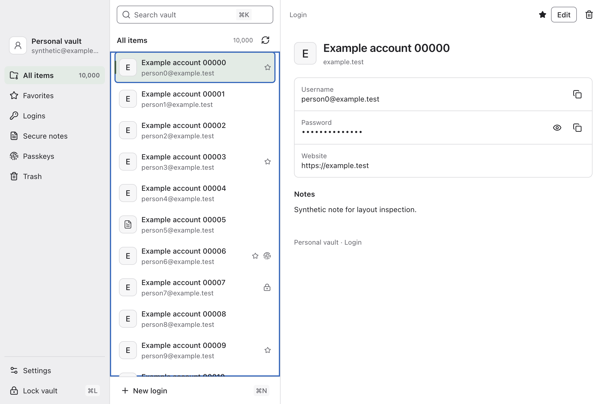

# Latch

**Your vault, within reach.** A quiet Mac app and inline browser picker for your existing Bitwarden passwords.

Private MVP · macOS Apple Silicon · Chrome / Aside



## What works

- Connect a Bitwarden account using your email/master password or personal API key plus master password. Choose US, EU, or an HTTPS self-hosted server.
- Search a local, virtualized vault; view personal logins and notes; filter favorites; create logins, edit logins and secure notes, move items to the Bitwarden trash and restore them from it; generate strong passwords.
- Focus a login field to see matching accounts. Choose one with a click or keyboard. Enable automatic page-load filling for individual sites from the extension popup.
- Unlock with Touch ID instead of typing the master password, once you turn it on in settings.
- Sign in on a website and Latch offers to save the new login, or update the password if it changed.
- Lock manually or on Mac lock/sleep/idle. Unlock an already-synced vault offline, including after restarting the app.
- Copy/reveal selected fields. Copied credentials expire after 30 seconds, without clearing unrelated clipboard content.

This is a **password MVP**. Passkeys are the next major integration. Logins and secure notes can be edited, and items can be moved to the trash and restored, though never deleted permanently; shared/protected items are restricted, other item types and passkey-bearing items are read-only, and passkey operations, enterprise features, and system-wide autofill are not implemented. See [security boundaries](SECURITY.md).

## Install and use

1. Install the official Bitwarden CLI: `brew install bitwarden-cli`. Latch discovers Homebrew and common Nix installations. A custom absolute path can be supplied through `LATCH_BW_PATH` when launching from a terminal.
2. Open **Latch.app** from the [private release](https://github.com/dillionverma/latch/releases/tag/v0.1.0). This preview is locally ad-hoc signed, not Developer ID notarized.
3. Sign in with your email and master password. If your account uses two-step login with an authenticator app, YubiKey OTP, or email, or Bitwarden wants to verify a new device, Latch asks for the code. The Bitwarden CLI cannot complete WebAuthn security keys, Duo, or SSO; for those, expand **Personal API key sign-in**. Obtain the key in Bitwarden's web vault → Settings → Security → Keys. Enter it directly into the app.
4. Open **Settings → Browser → Connect browser**.
5. In Chrome or Aside, open `chrome://extensions`, enable **Developer mode**, select **Load unpacked**, and choose the folder shown by **Show extension folder**.
6. Open a login page and focus a field. Keep Latch running; closing its window leaves the process available.

If the official Bitwarden extension's password picker is also enabled, disable its inline password suggestions to avoid two pickers. Its passkey functionality can remain available while Latch's passkey integration is unfinished.

Matching defaults to the saved website's exact host. To include sibling subdomains, set that login's URI match to **Base domain** in Bitwarden. Latch cannot read the other clients' global matching preferences.

**Shortcuts:** `⌘K` search · `⌘N` new login · `⌘,` settings · `⌘L` lock · `⌘⇧Space` show Latch (when available).

Latch supplies its own application data directory to the Bitwarden CLI. The installed CLI must honor that path; the current design pass found an unresolved isolation issue with the discovered Nix CLI. See [verification limits](docs/verification.md#browser-and-account-limits) before using it with a real account. Latch does not save the master password or search index. Session keys stay in memory unless optional Touch ID is enabled; see its storage limits in SECURITY.md. Upstream CLI authentication state and encrypted vault data remain on disk.

## Appearance

The app follows system light/dark appearance. Credential panes and overlays are opaque. Solid navigation is the default. The packaged native addon is available only through the developer override `LATCH_MATERIAL=glass` on macOS 27.0; packaged native window captures are available, but desktop compositing, glass contrast and the full accessibility/lifecycle matrix remain unverified. `solid`, `vibrancy`, and `unavailable` select deterministic inspection paths. Reduce Transparency or Increase Contrast forces solid for that window until relaunch.

## Develop

Use Node 22 with npm 10 for the upstream CLI's supported development runtime.

```sh
npm ci
npm run dev
```

If your npm configuration blocks install scripts, allow Electron and esbuild's install scripts or run their documented installers before building.

```sh
npm run check          # TypeScript and release build
npm run format:check
npm run package        # release/mac-arm64/Latch.app
```

The packaged application uses the separately installed official CLI. The npm CLI is not a project dependency and is excluded from release packaging because its published bundle contains separately licensed modules. [Third-party details](THIRD_PARTY.md).

## Verification

Do not add or run automated tests. Use type checking, production builds, packaging, and manual UI checks with isolated synthetic data. Keep credentials out of logs and screenshots. See [current verification and limits](docs/verification.md). Earlier evidence is kept separately and labeled historical.

Manual checks should cover light/dark appearance, keyboard focus, lock clearing, dialogs, and browser filling on a disposable account. Record what was inspected and leave unverified behavior explicit.

## Structure

```text
src/desktop/     Vault adapter, lock lifecycle, native bridge, Electron shell
src/extension/   MV3 background, inline picker, per-site settings
src/renderer/    React desktop interface and design tokens
src/shared/      Typed, validated messages and safe results
```

React, TypeScript, Vite, Electron, TanStack Virtual. Small local state; no application framework inside web pages. The browser content script is approximately 20 KiB minified, including shared theme CSS. The full [original plan](docs/original-plan.md) covers later passkeys and feature parity.

Latch is independent and not affiliated with Bitwarden. Original source: [GPL-3.0-only](LICENSE).
