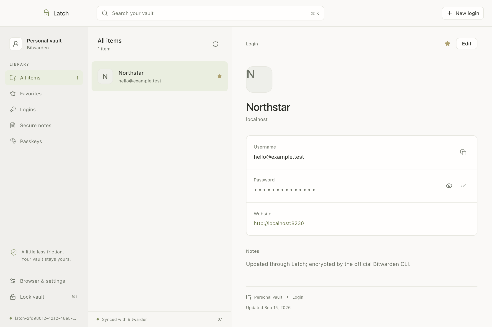

# Latch

**Your vault, within reach.** A quiet Mac app and inline browser picker for your existing Bitwarden passwords.

Private MVP · macOS Apple Silicon · Chrome / Aside



## What works

- Connect a Bitwarden account using your email/master password or personal API key plus master password. Choose US, EU, or an HTTPS self-hosted server.
- Search a local, virtualized vault; view personal logins and notes; filter favorites; create and edit personal logins; generate strong passwords.
- Focus a login field to see matching accounts. Choose one with a click or keyboard. Enable automatic page-load filling for individual sites from the extension popup.
- Lock manually or on Mac lock/sleep/idle. Unlock an already-synced vault offline, including after restarting the app.
- Copy/reveal selected fields. Copied credentials expire after 30 seconds, without clearing unrelated clipboard content.

This is a **password MVP**. Passkeys and Touch ID are the next major integrations. Shared/protected items are restricted, passkey-bearing items are read-only, and automatic save prompts, enterprise features, and system-wide autofill are not implemented. See [security boundaries](SECURITY.md).

## Install and use

1. Install the official Bitwarden CLI: `brew install bitwarden-cli`. Latch discovers Homebrew and common Nix installations. A custom absolute path can be supplied through `LATCH_BW_PATH` when launching from a terminal.
2. Open **Latch.app** from the [private release](https://github.com/dillionverma/latch/releases/tag/v0.1.0). This preview is locally ad-hoc signed, not Developer ID notarized.
3. Sign in. For 2FA or a sign-in challenge, expand **Personal API key sign-in**. Obtain the key in Bitwarden's web vault → Settings → Security → Keys. Enter it directly into the app.
4. Open **Browser & settings → Connect browser**.
5. In Chrome or Aside, open `chrome://extensions`, enable **Developer mode**, select **Load unpacked**, and choose the folder shown by **Show extension folder**.
6. Open a login page and focus a field. Keep Latch running; closing its window leaves the process available.

If the official Bitwarden extension's password picker is also enabled, disable its inline password suggestions to avoid two pickers. Its passkey functionality can remain available while Latch's passkey integration is unfinished.

Matching defaults to the saved website's exact host. To include sibling subdomains, set that login's URI match to **Base domain** in Bitwarden. Latch cannot read the other clients' global matching preferences.

**Shortcuts:** `⌘K` search · `⌘N` new login · `⌘L` lock · `⌘⇧Space` show Latch (when available).

Latch uses its own application data directory and Bitwarden CLI session. Your existing Bitwarden installation remains a separate client. No master password, session key, or search index is intentionally saved by Latch; upstream CLI authentication state and encrypted vault data remain on disk.

## Develop

Use Node 22 with npm 10 for the upstream CLI's supported development runtime.

```sh
npm ci
npm run dev
```

If your npm configuration blocks install scripts, allow Electron and esbuild's install scripts or run their documented installers before building.

```sh
npm run check          # TypeScript, focused security/unit tests, release build
npm run format:check
npm run package        # release/mac-arm64/Latch.app
```

The packaged application uses the separately installed official CLI. The pinned npm CLI is **development-only**, used by the automated test fixture. It is deliberately excluded from release packaging because the published bundle contains separately licensed modules. [Third-party details](THIRD_PARTY.md).

## Real end-to-end tests

Docker (or OrbStack), OpenSSL, and a macOS GUI session are required. All vault data is disposable and synthetic; no personal vault is accessed.

```sh
npm run test:server
npx playwright install chromium
npm run build
npm run test:e2e
npm run test:e2e:aside     # Requires /Applications/Aside.app
npm run test:server:stop
```

The tests create an isolated account on Vaultwarden 1.37.3, use a temporary HTTPS certificate trusted only by the test's child processes, and drive the actual Electron UI and browser extension. They verify encrypted create/edit, inline fill and a successful form submission, per-site automatic filling, mismatched-origin rejection, lock/clipboard clearing, wrong-password rejection, and offline unlock/restart. Separate tests verify native-bridge authentication, IPC validation, URI rules, stale edits, and pending-operation lock behavior.

To test the packaged app with the installed CLI:

```sh
LATCH_TEST_APP="$PWD/release/mac-arm64/Latch.app/Contents/MacOS/Latch" \
  npx playwright test tests/e2e/mvp.spec.ts
```

The 10,000-item renderer benchmark uses a synthetic IPC adapter. Its results do not measure network, decryption, or real bridge latency. See [verification](docs/verification.md).

## Structure

```text
src/desktop/     Vault adapter, lock lifecycle, native bridge, Electron shell
src/extension/   MV3 background, inline picker, per-site settings
src/renderer/    React desktop interface and design tokens
src/shared/      Typed, validated messages and safe results
tests/          Security boundaries and real end-to-end fixtures
```

React, TypeScript, Vite, Electron, TanStack Virtual. Small local state; no application framework inside web pages. The browser content script is approximately 9 KB minified. The full [original plan](docs/original-plan.md) covers later passkeys and feature parity.

Latch is independent and not affiliated with Bitwarden. Original source: [GPL-3.0-only](LICENSE).
