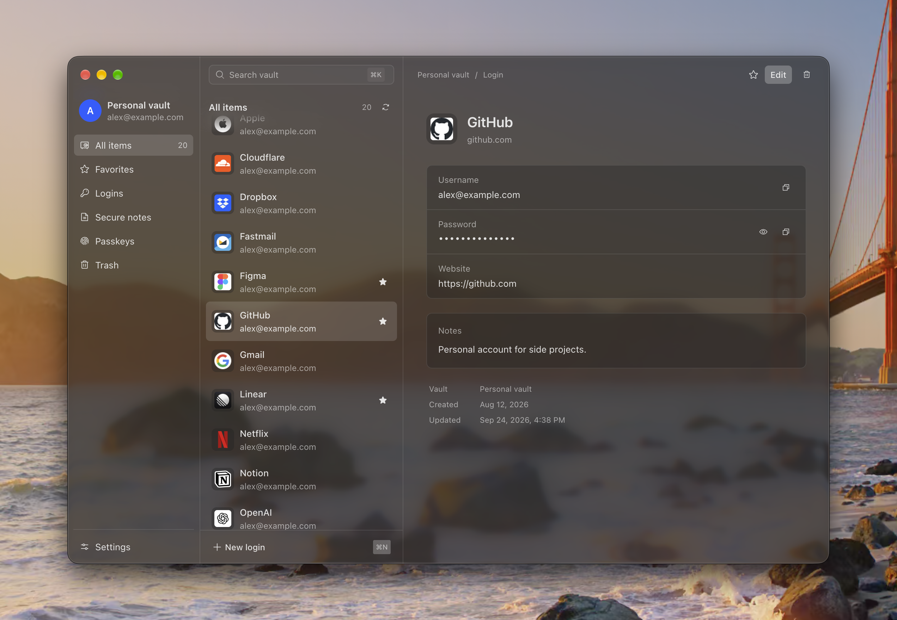

<p align="center">
  
</p>

<h1 align="center">Latch</h1>

<p align="center">
  <strong>Your Bitwarden vault. A better way to use it.</strong>
</p>

<p align="center">
  <a href="#highlights">Highlights</a> ·
  <a href="#installation">Installation</a> ·
  <a href="#development">Development</a>
</p>

<p align="center">
  
</p>

Latch is an alternative client for your existing Bitwarden vault, designed around a cleaner interface and quicker workflows. Search from the keyboard, fill logins in your browser, and access credentials from Raycast. Keep your account and vault; there's nothing to migrate.

## Highlights

- ✨ **A more considered interface.** Clear layouts, light and dark themes, and a glass finish on macOS.
- ⚡ **Keep your hands on the keyboard.** Jump to search with ⌘K / Ctrl+K, find a login, and copy what you need.
- 🌐 **Fill where you browse.** Bring Latch to Chrome, Aside, and other browsers. [See browser availability](#browser-extensions).
- 🚀 **Your vault in Raycast.** Search, unlock, and copy credentials straight from your launcher on Mac.
- 👆 **Less typing, more control.** Unlock with Touch ID on Mac, choose when your vault locks, and configure generated passwords.
- 🔑 **Keep Bitwarden underneath.** Your existing account and vault, with authentication and cryptography handled by the official Bitwarden CLI.

## Installation

### Desktop

| Platform                                                                                                                                                                                                                                                                                                                                                                    | Availability                 | Get Latch                                                                                                  |
| :-------------------------------------------------------------------------------------------------------------------------------------------------------------------------------------------------------------------------------------------------------------------------------------------------------------------------------------------------------------------------- | :--------------------------- | :--------------------------------------------------------------------------------------------------------- |
| <picture><source media="(prefers-color-scheme: dark)" srcset="https://cdn.jsdelivr.net/gh/pheralb/svgl@ed75393dbe6eba6e446e208abb6826ecd1abd36d/static/library/apple_dark.svg" /></picture> **macOS** · Apple Silicon | Preview                      | [Download ZIP](https://github.com/dillionverma/latch/releases/download/v0.1.0/Latch-0.1.0-macos-arm64.zip) |
|  **Linux**                                                                                                                                                                                                            | Experimental · AppImage, deb | [Build from source](#development)                                                                          |
|  **Windows**                                                                                                                                                                                                        | In development               | No download yet                                                                                            |

The published Mac preview is v0.1.0. For the interface shown above, [build the current app](#development). Linux and Windows support is incomplete.

<details>
<summary><strong>Set up on macOS</strong></summary>

1. Unzip the download and move **Latch.app** to **Applications**.
2. Install the official Bitwarden CLI:

   ```sh
   brew install bitwarden-cli
   ```

3. Open Latch and sign in to your Bitwarden account.

The preview is ad-hoc signed and not notarized.

</details>

### Browser extensions

Use Latch to fill logins without leaving your browser. Extensions currently require the Mac app to stay running and are installed manually.

<details>
<summary> <strong>Chrome & Chromium browsers</strong></summary>

 Chrome ·  Brave ·  Edge ·  Arc ·  Vivaldi ·  Chromium · Aside

1. In the current Latch app, open **Settings → Browser → Get extension**.
2. Open your browser's extensions page and enable **Developer mode**.
3. Choose **Load unpacked** and select the folder Latch opened.

Open the extension to connect. Latch handles desktop setup automatically and shows **Connected** in Settings. Reload the extension after updating Latch.

Chrome and Aside have been verified; the other Chromium browsers still need end-to-end verification.

</details>

<details>
<summary> <strong>Firefox</strong> · developer preview</summary>

Requires Firefox 140+ and a [source checkout](#development).

1. Run `pnpm run extension:build` and start the current Latch app.
2. Open `about:debugging` → **This Firefox** → **Load Temporary Add-on**.
3. Select `apps/extension/.output/firefox-mv3/manifest.json`.

Temporary installation lasts until Firefox restarts. No signed download is available; end-to-end verification is pending.

</details>

<details>
<summary> <strong>Safari</strong> · signed builds</summary>

Latch offers a Safari extension and native macOS AutoFill for Safari and supported Mac apps. Both require a signed build with the appropriate Apple provisioning profiles.

- **Safari extension:** build with `pnpm run package:autofill` and provide `LATCH_SAFARI_PROFILE` alongside the app and AutoFill profiles. Its app group must match Latch's. End-to-end verification is pending.
- **macOS AutoFill:** follow the [signing and setup guide](apps/desktop/native/autofill/README.md).

</details>

### Raycast

 **Latch for Raycast** brings vault search, unlocking, and copying to your launcher on Mac. [Install the extension →](apps/raycast/README.md)

## Development

Node **24.11+ or 22.18+**, pnpm **11.25.0**, and Xcode for Mac builds.

```sh
git clone https://github.com/dillionverma/latch.git
cd latch
pnpm install --frozen-lockfile
pnpm run dev
```

Run `pnpm run check` before submitting changes. It checks formatting, lint, types, and all builds. The workspace uses Electron, [Vite+](https://viteplus.dev), and WXT with one install and lockfile.

<details>
<summary>Packaging and release notes</summary>

**Packages.** Run on the target operating system. Output is written to `apps/desktop/release/`.

```sh
pnpm run package:mac    # DMG and ZIP, Apple Silicon
pnpm run package:linux  # AppImage and deb
pnpm run package:win    # NSIS installer
```

Linux still needs CLI discovery and browser registration work. Windows needs a local transport port before the app can run. The manual [desktop workflow](.github/workflows/desktop.yml) builds unsigned macOS and Linux artifacts.

**Development builds.** Desktop hot reload reuses native and browser assets after building missing outputs. Run `pnpm --filter @latch/desktop build` and restart development after changing those assets. `pnpm run check` regenerates WXT types before checking and building the workspace.

The root build selects desktop and Raycast; desktop depends on the extension build. Keep that selection to avoid duplicate extension builds in Vite+ rc.0. WXT targets run sequentially because they share generated types. Build caching is disabled for host- and signing-dependent tasks.

**Releases.** `pnpm run package` creates an unsigned, non-notarized Mac app. `pnpm run package:release` requires Apple signing inputs and notarizes without publishing. Matching stable version tags trigger the [macOS draft-release workflow](.github/workflows/release.yml).

</details>

## License

[MIT](LICENSE). Platform and browser icons from [SVGL](https://svgl.app/). Third-party notices are included in build output.
