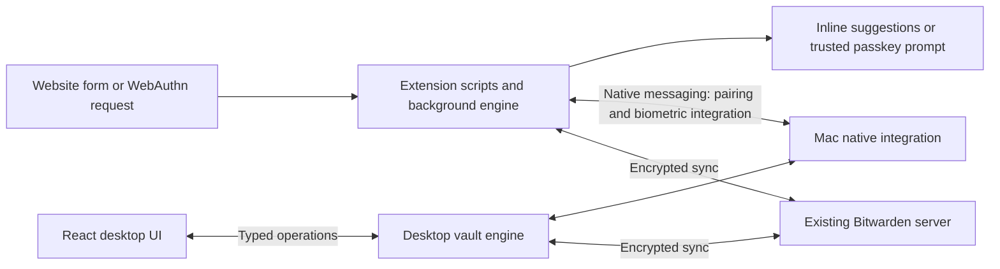

# A fast, clean Bitwarden client for macOS

## Recommendation

Build an open-source macOS app **and** an Aside/Chrome extension. Use **React + TypeScript + Electron** for the desktop, React for the extension popup and passkey UI, and a deliberately small inline autofill surface. Reuse Bitwarden's existing client foundations behind explicit adapters. Keep Bitwarden as the server and source of truth.

Start with a browser-first feasibility milestone. It must demonstrate the desired login experience inside Aside before we invest in the complete desktop UI.

The intended experience:

- Open a login form: a small inline control and relevant accounts appear automatically.
- Choose an account: fill the form; optionally submit on sites where that works reliably.
- A site requests a passkey: show the matching account immediately, authorize once with confirmation or Touch ID as required, complete the request, and close the prompt.
- Open the vault: immediate search, compact lists, clean details, and background sync.

**Effort estimate:** roughly **6–10 weeks for a useful personal daily-driver subset**, **12–20 engineering weeks for a credible public beta**, and **6–12+ months for broad personal-feature parity and wider platform coverage**. These are planning estimates for one experienced full-time engineer using AI assistance, with separate specialist security review before a general release. They are not measured delivery promises. Full enterprise parity is a separate, larger undertaking.

## Confirmed scope and assumptions

- The user expects to open-source the project.
- First-class platforms: macOS and Aside/Chrome.
- Proposed first release target: Apple Silicon, macOS 15+; expand after compatibility testing.
- Keep existing Bitwarden accounts and vaults. No migration to a new service.
- Support Bitwarden-hosted US/EU accounts first. Self-hosted Bitwarden and Vaultwarden are later compatibility targets, not presumed equivalent.
- Native Mac appearance and behavior are required; a fully SwiftUI implementation is not assumed.
- Safari, a macOS system credential-provider extension, mobile clients, enterprise administration, and a hosted backend are outside the first milestone. Existing official mobile clients continue to access the same vault.
- Unknown account-specific requirements—SSO, organization policies, multiple accounts, premium features—must be inventoried during the feasibility milestone without accessing real vault contents in agent logs.

## 1. What the research establishes

### The main work is broader than a desktop UI

A desktop app alone cannot supply a custom inline button inside arbitrary Aside/Chrome web pages. We need browser content scripts, a background runtime, and a browser-to-desktop integration for features such as biometric unlock.

Bitwarden already implements inline suggestions and page-load filling. The opportunity is to improve speed, defaults, account selection, presentation, and failure recovery. We should reuse its field detection and matching behavior before replacing any of it. [Autofill documentation](https://bitwarden.com/help/auto-fill-browser/)

### Passkeys can be low-friction, but not universally silent

Passkeys sign a site-specific challenge; they are not text inserted into a field. WebAuthn authentication requires user presence, and some sites require user verification. A previously unlocked vault is not a blanket authorization for every subsequent request. We must not fabricate the user-presence or user-verification result. A single suitable gesture can satisfy both checks. [WebAuthn specification](https://www.w3.org/TR/webauthn-3/)

Define success as **automatic discovery + the minimum legitimate authorization + automatic completion**. Site behavior, account ambiguity, browser restrictions, and authenticator requirements can still add steps.

### Bitwarden offers useful reuse boundaries, not a finished third-party app SDK

The existing browser passkey implementation has a separate `Fido2UserInterfaceService` abstraction, with session messages for account selection, confirmation, cancellation, and fallback. This is a promising replacement point for our UI. [Current UI adapter](https://github.com/bitwarden/clients/blob/a75e8e2175f094e020db2835870da58bad7c9e20/apps/browser/src/autofill/fido2/services/browser-fido2-user-interface.service.ts)

However, the desktop native-provider documentation describes dependencies on Electron, native IPC, and Angular-renderer services. Replacing the renderer while retaining these services is real integration work. [Desktop provider architecture](https://github.com/bitwarden/clients/blob/a75e8e2175f094e020db2835870da58bad7c9e20/apps/desktop/desktop_native/autofill_provider/README.md)

The internal Rust SDK contains useful auth, crypto, vault, and FIDO modules, but its current `new_with_sync` still has incomplete sync-handler registration and explicitly describes a migration in progress. Do not estimate this as “import SDK, write screens.” [SDK source](https://github.com/bitwarden/sdk-internal/blob/6c7dbdfbdc8b662d5c6868967e4cc69a2b93c13f/crates/bitwarden-pm/src/lib.rs)

The documented public API is mainly for organization administration; the Vault Management API wraps the CLI. Neither should be mistaken for a ready-made browser credential-provider engine. [Bitwarden APIs](https://bitwarden.com/help/bitwarden-apis/)

## 2. Implementation strategy

| Approach                                                          | Benefit                                                              | Main cost                                                         | Decision                                       |
| ----------------------------------------------------------------- | -------------------------------------------------------------------- | ----------------------------------------------------------------- | ---------------------------------------------- |
| Restyle the official Angular clients                              | Fastest route to visual improvements with existing behavior          | Less freedom; UI still tied closely to upstream                   | Good fallback or short experiment              |
| Reuse official foundations; replace presentation through adapters | More UI control while retaining protocol knowledge and compatibility | Extracting boundaries and maintaining an upstream patch set       | **Recommended**                                |
| Fresh Tauri/Rust client using the internal SDK                    | Potentially smaller desktop footprint and clean ownership            | More auth/sync integration and browser work before feature parity | Reconsider only if the first spike supports it |
| Fully native SwiftUI app                                          | Strong native desktop integration                                    | Separate web UI still required; much less presentation reuse      | Not the initial route                          |

### Licensing and upstream maintenance

Propose GPL-3.0-compatible distribution to align with reused Bitwarden client code. Verify the actual dependency graph and retain required notices. The client repository defaults to GPL but has a separately licensed directory; the SDK also has mixed licensing. Open source does not make every file freely redistributable. Restricted modules must be excluded or separately licensed, and premium entitlements and organization policies must remain enforced. Use our own name, icons, bundle identifiers, extension identifiers, and update infrastructure. [Client license](https://github.com/bitwarden/clients/blob/main/LICENSE.txt), [SDK license](https://github.com/bitwarden/sdk-internal/blob/main/LICENSE)

Keep vendored upstream code at a recorded commit with a small, documented patch series. Make UI adapters our main change boundary. Run compatibility tests whenever upstream changes are adopted; prioritize security fixes. Publishing an open-source repository does not remove the ongoing maintenance obligation.

### Concrete technology choices

| Layer                          | Proposed choice                                                                                                   |
| ------------------------------ | ----------------------------------------------------------------------------------------------------------------- |
| Desktop shell                  | Electron; reuse the relevant official desktop/native foundations                                                  |
| Desktop and extension popup UI | React 19, TypeScript, Vite, shared UI tokens and components                                                       |
| Component primitives           | Radix UI, styled for macOS rather than stock website defaults                                                     |
| Styling                        | Tailwind/CSS variables, system font, light/dark themes                                                            |
| UI state                       | Jotai for small local state; TanStack Query for asynchronous metadata with explicit lock-time cache clearing      |
| Large vault lists              | TanStack Virtual; stable row IDs and bounded rendering                                                            |
| Browser extension              | Manifest V3; retained field-detection/WebAuthn infrastructure; new presentation surfaces                          |
| Inline form UI                 | Retain/adapt the small upstream Lit/DOM implementation initially; avoid mounting a full application in every page |
| Vault engine                   | Pinned upstream TypeScript/Rust/WASM components, isolated behind typed operations; verify extraction in phase 0   |
| Local persistence              | Preserve upstream encrypted storage semantics initially; no plaintext search index on disk                        |
| Mac integration                | Keychain/LocalAuthentication through reviewed native helpers; native messaging for browser integration            |
| Delivery                       | Signed/notarized Mac builds, signed update channel, a stable Chrome Web Store extension identity                  |

Electron is the starting choice because BB demonstrates the experience the user likes and Bitwarden's existing desktop integration already uses it. This is an implementation-effort decision, not a claim that Electron is inherently faster or smaller than Tauri.

### Runtime boundaries



Initially, desktop and browser remain independently functioning clients with their own encrypted caches, reusing the same upstream logic. Reuse shared-unlock mechanisms where compatible; do not invent a new key-transfer protocol just to avoid two client sessions. Closing the desktop window should not stop an already-unlocked extension from filling passwords. When the desktop process is unavailable, biometric operations need a clear unlock fallback.

Move expensive decryption, matching, and indexing out of presentation work. The initial spike must establish how to run the necessary upstream services without retaining a second hidden Angular application indefinitely. If that extraction is too invasive, ship the limited extension redesign first and revise the desktop estimate before continuing.

The desktop renderer receives item summaries and explicitly requested detail fields. The website receives only the selected fill values or a WebAuthn response. Passkey private keys and the full vault must never be forwarded into the page. Password filling necessarily exposes the selected password to the destination page; do not claim otherwise.

## 3. Exact login experience

### Passwords

1. Detect a relevant form without requiring a toolbar click.
2. Show a discreet inline icon; focusing the field reveals matching accounts.
3. If there is one match, Enter or one click fills it. If locked, request unlock and resume the original action automatically.
4. Support an explicit per-site preference for filling on page load; default to on-demand inline filling. Offer a broader default only with the security tradeoff made clear once in settings.
5. Keep automatic submission a separate preference. Avoid submitting CAPTCHAs, ambiguous forms, and unsupported multi-step pages; let users disable it for a site.
6. Offer compact save/update prompts after successful entry, generation during signup, and TOTP completion where supported.

Account matching must respect URI rules, equivalent domains, frame origins, and organization restrictions. Never make a recently used credential outrank an incompatible domain.

### Passkeys

| Situation                                                   | Intended behavior                                                                                         |
| ----------------------------------------------------------- | --------------------------------------------------------------------------------------------------------- |
| Explicit site request, one matching account, vault unlocked | Automatically open a compact trusted prompt showing site/account; one authorization; complete and dismiss |
| Site uses conditional mediation                             | Surface a passkey in the inline suggestion list; do not open a modal merely because the page loaded       |
| Vault locked                                                | Unlock once, then resume the pending request; combine steps only where the verification semantics permit  |
| Several accounts                                            | Compact picker with a useful default; no silent account guessing                                          |
| New passkey                                                 | Confirm site/account and destination vault; save compatibly and return the registration response          |
| No match / hardware-bound requirement                       | Clear route to the browser/system authenticator, security key, or phone                                   |
| Cancel, timeout, tab navigation, or replaced request        | Cancel exactly once and close stale UI; never sign the old request                                        |

First preserve the current upstream WebAuthn implementation and test it in our target browsers. Evaluate Chrome's `webAuthenticationProxy` separately rather than assuming it is a universal fix: it is documented for remote-desktop software, suspends normal handling while attached, and permits only one attached extension. Validate Aside support, conditional requests, cancellation, origin information, fallback, and store-policy suitability before adopting it. [Chrome API](https://developer.chrome.com/docs/extensions/reference/api/webAuthenticationProxy)

Do not claim support for arbitrary hardware attestation, every WebAuthn extension, or sites that never offer passkeys. Preserve supported upstream capabilities such as credential-ID handling and counter/backup semantics. Unsupported PRF or other extension requirements must be handled explicitly, not emulated incorrectly.

## 4. Mac design direction

I inspected Monocode's screenshot and CSS. The useful qualities are compact layout, muted neutral surfaces, fine dividers, system typography, restrained accent color, native window controls, and brief feedback animations. Its current implementation uses React/Tauri. We can carry those design qualities into an Electron app. [Monocode](https://github.com/hardbeat920/monocode), [style source](https://github.com/hardbeat920/monocode/blob/d70437f1e6d034eac7d05733a3b526d67823f5da/src/index.css)

Proposed layout:

```text
┌ ● ● ● ───────────────────── Search vault…   ⌘K ── + ┐
│ All items      │ GitHub                │ GitHub       │
│ Favorites      │ Google · personal     │ username     │
│ Passkeys       │ Google · work         │ password  •• │
│ Logins         │ Linear                │ passkey      │
│ Cards          │ …                     │ code  123456 │
│ Secure notes   │                       │ website      │
│                │                       │              │
│ Vaults/folders │                       │ Edit · Copy  │
│ Sync · Locked  │                       │              │
└──────────────────────────────────────────────────────┘
```

- Three resizable panes; collapse the sidebar at small window sizes.
- System light/dark appearance; understated materials with an opaque/reduced-transparency fallback.
- Compact readable rows, clear selection/focus states, no oversized dashboard cards.
- One-click field copy; reveal is distinct from copy; editable details stay in context.
- Keyboard navigation throughout; global quick access plus in-app command search.
- Native menu bar, traffic lights, window restoration, focus handling, Touch ID, and accessible labels.
- In search and selection, show the result immediately. Use approximately 100–160 ms animation only for feedback and small transitions; respect reduced motion.
- Show quiet but truthful sync state: saved locally, syncing, synced, or needs attention. Never call an unsynced passkey safely backed up.

## 5. Feature boundaries

| Capability                                                  | Daily-driver subset                                  | Public beta / broad personal coverage                          |
| ----------------------------------------------------------- | ---------------------------------------------------- | -------------------------------------------------------------- |
| Bitwarden Cloud login, supported personal 2FA, KDF handling | Required                                             | Expand authentication methods after testing                    |
| Encrypted sync and offline unlock/read/search/fill          | Required                                             | Tested reconnect, token refresh, key rotation, revocation      |
| Login CRUD, folders, favorites, search, generation          | Required                                             | Bulk organization, password history, trash/restore             |
| Passkey creation and use                                    | Required on agreed test set                          | Broader edge cases and cross-client validation                 |
| Inline passwords, save/update prompts, multi-step forms     | Required                                             | Broader site coverage, cards/identities/custom fields          |
| TOTP, secure notes, cards, identities                       | Read/preserve; TOTP use                              | Full editing and supported fill behavior                       |
| Shared organizations and collections                        | Preserve; use only with verified permission handling | Tested writes/sharing and policy enforcement                   |
| Touch ID and browser pairing                                | Required                                             | Restart/reboot/update resilience and diagnostics               |
| Attachments, Sends, imports/exports, SSH items              | Explicitly deferred or read-only                     | Add with entitlement and round-trip tests                      |
| Multiple accounts                                           | Not required for first proof                         | Personal/work switching before calling it broad parity         |
| Offline edits                                               | Defer in first subset                                | Add only with proven conflict handling and visible sync status |
| Vaultwarden / self-hosted servers                           | Deferred                                             | Explicit version and behavior test matrix                      |
| Safari / native app autofill                                | Deferred                                             | Separate platform milestone and native provider packaging      |
| SSO, SCIM, emergency access, enterprise administration      | Official web vault remains available                 | Separate scope; no full-parity claim                           |

Unsupported item types must be preserved and shown as read-only or unsupported. Never serialize a partial view back over an item and discard fields that our UI does not understand. Block writes on items subject to policies we cannot faithfully enforce.

## 6. Performance requirements and BB lessons

BB contains actual list virtualization, lazy loading, deferred plugin initialization, and build-time bundle budgets. These are useful implementation patterns; I have not profiled BB and cannot attribute its speed quantitatively to any one of them.

- [Virtualized timeline](https://github.com/get-bb/bb/blob/6084f894305e389604ce19b1cace442b0fc25bad/apps/app/src/components/thread/timeline/TimelineWindowedItems.tsx)
- [Lazy-loaded timeline](https://github.com/get-bb/bb/blob/6084f894305e389604ce19b1cace442b0fc25bad/apps/app/src/components/thread/timeline/TimelineWindowedItemsLoader.tsx)
- [Startup scheduling](https://github.com/get-bb/bb/blob/6084f894305e389604ce19b1cace442b0fc25bad/apps/app/src/lib/plugin-frontend-boot-schedule.ts)
- [Bundle budgets](https://github.com/get-bb/bb/blob/6084f894305e389604ce19b1cace442b0fc25bad/apps/app/bundle-budget.json)

Provisional acceptance targets on a named Apple Silicon Mac with a synthetic 10,000-item vault, release builds, and reported p50/p95 results:

| Operation                                          | Initial target                                                    |
| -------------------------------------------------- | ----------------------------------------------------------------- |
| Open warm quick-access search                      | p95 ≤100 ms to useful results                                     |
| Update search results                              | p95 ≤50 ms after keystroke                                        |
| Select an already-indexed item                     | p95 ≤100 ms                                                       |
| Inline suggestions with warm/unlocked extension    | p95 ≤100 ms after field discovery/focus                           |
| Passkey UI after a request reaches an awake engine | p95 ≤150 ms, excluding user verification/network                  |
| Cold desktop launch to usable locked shell         | p95 ≤1.5 seconds                                                  |
| Scrolling                                          | Smooth 60 fps baseline, without recurring long main-thread stalls |

Measure service-worker wakeup, vault decryption, biometric dialogs, and network time separately. Never weaken a password KDF to hit an unlock target. Measure total app/helper memory and idle CPU; set firm budgets from phase-0 data rather than asserting an untested RAM number.

Implementation rules: local search; no sync per keystroke; indexed metadata in memory only while unlocked; virtualized rows; batch sync updates; lazy-load editors/importers/reports; avoid layout-wide subscriptions; stop TOTP timers when hidden; bounded DOM observation in content scripts; no full React bundle injected into every tab. Clear sensitive renderer/query caches on lock. Persist only non-sensitive preferences outside encrypted storage.

## 7. Work plan and completion gates

Durations below are additive engineering estimates for the recommended reuse approach, not simultaneous parallel-agent assignments.

| Phase                            | Effort    | Deliverable and gate                                                                                                                                                                                                                                  |
| -------------------------------- | --------- | ----------------------------------------------------------------------------------------------------------------------------------------------------------------------------------------------------------------------------------------------------- |
| 0. Feasibility                   | 1–2 weeks | Build eligible upstream code; prove Aside native messaging, unlock/resume, inline fill, passkey create/use, and a React-to-core boundary using test accounts. Record licenses, platform versions, timings, and any SDK gaps.                          |
| 1. Browser experience            | 2–3 weeks | Forked extension with redesigned inline suggestions, compact passkey UI, cancellation/fallback, generation/save/update flows, and one-provider onboarding. Demo on the agreed sites.                                                                  |
| 2. Mac daily-driver subset       | 3–5 weeks | Electron/React vault, fast search, login editing, offline read/fill, Touch ID, native menus, quiet sync, and quick access. Verify official-client interoperability.                                                                                   |
| 3. Personal-feature completeness | 3–5 weeks | Remaining item forms, permissions, history/trash, multi-account behavior, attachments/Send/export as prioritized; robust sync/error handling.                                                                                                         |
| 4. Public beta hardening         | 3–5 weeks | Threat-model review, adversarial tests, independent security review and fixes, accessibility/performance checks, signing/notarization, extension distribution, updater/rollback, support docs. External review/store queues can extend calendar time. |

Total: **12–20 engineering weeks**. A limited daily-driver appears after phases 0–2, approximately **6–10 weeks**. A visual prototype with fake data can take days, but is not evidence of vault or browser correctness.

Two experienced engineers could overlap desktop and extension work after phase 0, but the compatibility and security gates still need to pass. Do not halve the estimate mechanically. A full independent protocol/crypto rewrite is outside these estimates.

### Phase 0 stop/go criteria

Proceed with the React replacement only when:

1. The GPL-eligible build and dependency inventory are concrete.
2. An existing passkey created by the official client works in our test extension, and a newly created one works in the official client.
3. Locked → unlock → resume works in Aside and Chrome without losing the original request.
4. Native messaging installs cleanly for Aside; users do not need to copy manifests manually.
5. A renderer can list/search a synthetic vault through a narrow adapter without rebuilding the whole client runtime per interaction.
6. Test edits preserve supported fields and do not corrupt opaque/unsupported records.

If these fail, record the specific gap and rescope. The fallback is a smaller official-extension UX fork, not a claim that the full architecture is already feasible.

## 8. Validation required for a trustworthy release

### Compatibility

- Synthetic vaults of 100, 1,000, and 10,000 items.
- Dedicated Bitwarden Cloud test accounts; supported KDF settings and 2FA paths.
- Real Chrome and Aside sessions on recorded versions, including fresh install, suspended service worker, browser restart, sleep/wake, and app update.
- A locally controlled form/WebAuthn fixture suite plus roughly 20 representative sites; agree on the user's important sites before implementation.
- Username-first and password-first forms, React-controlled fields, SPA navigation, supported frames/shadow roots, password changes, multiple logins, TOTP, zoom, and dark mode.
- Passkey registration/assertion with explicit and conditional requests, required/preferred verification, multiple accounts, abort/timeout, fallback, and cross-client round trips.
- Test passkeys with a real test relying-party server; virtual-authenticator tests alone do not establish our provider works.

### Data safety and permissions

- Round-trip every supported item type through official and custom clients.
- Preserve attachments, custom fields, ownership, collection IDs, and passkey material during edits.
- Test stale reads, simultaneous edits, disconnect/reconnect, interrupted writes, token expiry, vault lock/logout, and organization revocation.
- Distinguish local persistence from server synchronization in UI and tests.
- Use encrypted test backups before compatibility mutations. Never bulk-import or export a real vault through agent chat or logs.

### Security boundaries

- Validate website/frame origins, RP IDs, navigation lifetime, and request identity in trusted background code. A page-supplied URL is not authority.
- Test wrong-domain fills, cross-origin frames, spoofed extension messages, clickjacking, stale passkey requests, and malicious vault text.
- Use extension-ID allowlists and authenticated/pinned native communication; avoid an unauthenticated localhost vault API.
- Electron renderer: sandbox, context isolation, no Node integration, strict CSP, narrow validated IPC, no arbitrary remote navigation. [Electron guidance](https://www.electronjs.org/docs/latest/tutorial/security)
- Lock clears application-level plaintext caches; minimize secret copies without claiming perfect garbage-collected memory erasure.
- Clipboard clearing must avoid deleting content the user copied afterward. Never log secrets or enable automatic sensitive crash uploads.
- Keep security-critical dependencies current; sign release artifacts; test update failure/rollback without downgrading incompatible vault storage.
- Publish a security reporting route and accurately describe audit scope. Inheriting upstream code does not mean our modified client is audited.

## First concrete deliverable

Build one thin vertical slice with fake data and dedicated test credentials:

**Aside login form → inline account → unlock if needed → fill**, followed by **site passkey request → compact authorization → successful sign-in**.

Show the desktop shell in the Monocode-inspired visual direction alongside it. Record click counts and latency against the current Bitwarden flow on the same sites. This proves whether the project improves the experience that motivated it before committing to feature parity.

## Research boundary

This document is a researched implementation proposal. No custom client was built, no vault was opened or modified, no account login or passkey ceremony was performed, and no performance/security claim was validated experimentally.

Source snapshots inspected: Bitwarden clients `a75e8e2175f094e020db2835870da58bad7c9e20`; Bitwarden SDK `6c7dbdfbdc8b662d5c6868967e4cc69a2b93c13f`; BB `6084f894305e389604ce19b1cace442b0fc25bad`; Monocode `d70437f1e6d034eac7d05733a3b526d67823f5da`. A build spike should select known-good release commits rather than automatically ship these research snapshots.
